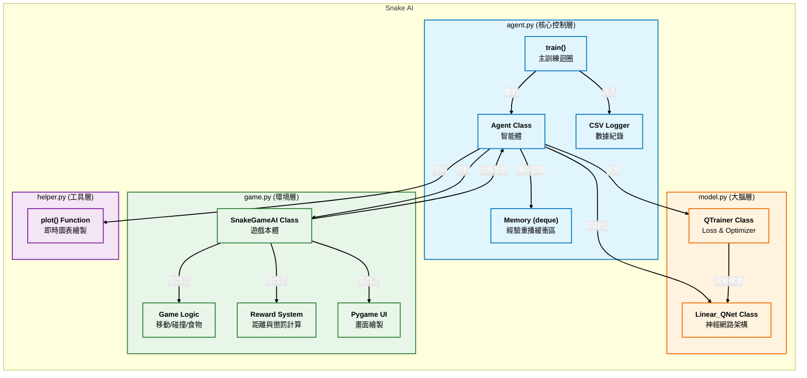

# Snake AI with Reinforcement Learning (DQN)

## 專案簡介

本專案實作了一個能夠自主學習遊玩經典遊戲「貪食蛇」的人工智慧系統。系統基於強化學習（Reinforcement Learning）中的 **深度 Q 學習 (Deep Q-Learning, DQN)** 演算法。

AI 智能體（Agent）將透過與環境（Environment）的互動，利用試錯法（Trial and Error）學習如何最大化生存時間並獲取最高分數。本實作在基礎 DQN 架構上，額外整合了 **獎勵機制優化 (Reward Shaping)** 以加速收斂，並包含完整的 **訓練數據監控系統**（圖表自動儲存與 CSV 數據記錄），以便於分析模型的收斂與發散情況。

---
## Breakdown




---	
## 系統構成與流程

本系統由四個核心模組組成，彼此協同運作：

1.  **Game Environment (`game.py`)**
    * 負責遊戲邏輯（移動、碰撞偵測、食物生成）。
    * 提供 API 供 Agent 呼叫 (`play_step`)。
    * **[優化]** 內建距離計算邏輯，根據蛇頭與食物的距離變化回傳額外獎勵 (Reward Shaping)。
2.  **Model (`model.py`)**
    * 定義深度神經網路 (`Linear_QNet`)：輸入狀態 -> 隱藏層 -> 輸出動作 Q 值。
    * 定義訓練器 (`QTrainer`)：執行貝爾曼方程式 (Bellman Equation) 的 Loss 計算與反向傳播。
    * ### Q-Learning 訓練機制 
      `QTrainer` 類別是本專案的核心訓練引擎，負責根據 AI 的經驗來更新神經網路的權重。它實作了 **Deep Q-Learning** 演算法，透過比較「預測結果」與「實際結果」的差異來優化模型。
      
      #### 核心原理：貝爾曼方程式 (Bellman Equation)
      
      Q-Learning 的核心概念在於更新 Q 值（Quality，代表在某個狀態下採取某個動作的預期價值）。我們使用 **貝爾曼方程式** 來計算目標 Q 值 : 
  
      $Q_{target}(s, a) = r + \gamma \cdot \max_{a'} Q(s', a') $

      其中：
      * **$s$ (State)**: 當前的狀態。
      * **$a$ (Action)**: 當前採取的動作。
      * **$r$ (Reward)**: 執行動作後獲得的立即獎勵。
      * **$s'$ (Next State)**: 執行動作後進入的下一個狀態。
      * **$\gamma$ (Gamma)**: 折扣率 (Discount Factor)，通常設為 0.9。它決定了 AI 對「未來獎勵」的重視程度（0 代表只看眼前，1 代表極度重視長遠）。
      * **$\max_{a'} Q(s', a')$**: AI 預測在下一個狀態 $s'$ 中，能獲得的最大潛在獎勵。
      
      ---
      
      #### 損失函數 (Loss Function)
      
      為了訓練神經網路，我們需要一個指標來衡量「預測有多準」。本專案使用 **均方誤差 (Mean Squared Error, MSE)**：
      
      $Loss = \frac{1}{N} \sum (Q_{target} - Q_{predicted})^2$
      
      
      * **$Q_{predicted}$**: 神經網路當前預測的 Q 值。
      * **$Q_{target}$**: 根據貝爾曼方程式計算出的「正確答案」。
      * **目標**: 透過優化器 (Adam Optimizer) 調整網路權重，使 Loss 最小化。
	      - 假設 AI 輸出層的預測是 [5.0, 2.0, 1.0] (直行, 右轉, 左轉)。
	      - AI 實際上選了「直行」。
	      - 貝爾曼公式算出直行的真實價值應該是 7.0。
	      - 我們只把 target 改成 [7.0, 2.0, 1.0]。
	      - 計算 MSE Loss 時，右轉和左轉的誤差是 0 (因為沒變)，只有直行的誤差 (7.0 - 5.0)^2

      ---
   
   3.  **Agent (`agent.py`)**
       * 系統總指揮。負責獲取狀態、做出決策（探索 vs 利用）、儲存記憶（Experience Replay）並觸發訓練。
       * **[優化]** 整合 CSV 數據記錄與收斂狀況判斷。
   4.  **Helper (`helper.py`)**
       * 負責視覺化訓練過程。
       * **[優化]** 支援即時圖表更新與自動存檔 (`training_graph.png`)。

---

## 功能規格

### 1. 核心演算法
* **模型架構**：Feed Forward Neural Network (以輸入乘上權重來獲得輸出（輸入對輸出）)
    * 輸入 Layer: 11 個神經元 (對應 11 個布林狀態)
    * 隱藏 Layer: 256 個神經元 (ReLU Activation)
    * 輸出 Layer: 3 個神經元 (Action: [Straight, Right, Left])
* **優化器**：Adam Optimizer (對過去梯度的方向做梯度速度調整)
* **損失函數**：MSE Loss (均方誤差)

#### 令輸入狀態向量為 $x \in \mathbb{R}^{11}$。

* 1. 隱藏層計算 (Hidden Layer Calculation)
輸入向量經過一次線性轉換 (Linear Transformation)，再通過 ReLU (Rectified Linear Unit) 激活函數，以提取高維特徵。

$$
h = \text{ReLU}(W_1 x + b_1)
$$

其中：
* $W_1 \in \mathbb{R}^{256 \times 11}$ 為連接輸入層與隱藏層的 **權重矩陣 (Weight Matrix)**。
* $b_1 \in \mathbb{R}^{256}$ 為隱藏層的 **偏差向量 (Bias Vector)**。
* 激活函數定義為 $\text{ReLU}(z) = \max(0, z)$。

* 2. 輸出層計算 (Output Layer Calculation)
隱藏層提取的特徵經過第二次線性轉換，映射為最終的 Q 值輸出。

$$
y = W_2 h + b_2
$$

其中：
* $y \in \mathbb{R}^{3}$ 為輸出向量，包含各動作的 Q 值: $[Q_{\text{straight}}, Q_{\text{right}}, Q_{\text{left}}]$。
* $W_2 \in \mathbb{R}^{3 \times 256}$ 為連接隱藏層與輸出層的 **權重矩陣**。
* $b_2 \in \mathbb{R}^{3}$ 為輸出層的 **偏差向量**。

* 3. 決策制定 (Decision Making)
智能體採用貪婪策略 (Greedy Policy)，選擇 Q 值最大的動作索引作為下一步的行動。

$$
\text{Action} = \arg\max(y)
$$


### 2. 狀態定義 (State Representation)
AI 接收的 11 個輸入特徵：
* **危險偵測 (3)**：正前方、右方、左方是否有障礙物。
* **移動方向 (4)**：目前是否向左、右、上、下移動。
* **食物方位 (4)**：食物位於蛇頭的左、右、上、下。

### 3. 獎勵機制 (Reward System) [優化項目]
為了引導 AI 更快學習，採用以下混合獎勵策略：
* **吃到食物**：`+10` 分
* **死亡 (撞牆/撞身)**：`-10` 分
* **距離獎勵 (Heuristic)**：
    * 移動後**靠近**食物：`+0.1` 分
    * 移動後**遠離**食物：`-0.2` 分
	* **步數懲罰**：`-0.01` 分
    * *步數懲罰目的：每走一步都扣一點分，逼它走最短路徑，減少初期無意義的徘徊。*

### 4. 記憶與訓練 (Memory & Training)
* **短期記憶 (Short-term Memory)**：每一步驟後立即訓練該步經驗。
* **長期記憶 (Experience Replay)**：遊戲結束後，從記憶庫 (Max 100,000 筆) 隨機抽取 Batch (1,000 筆) 進行訓練，避免遺忘舊經驗。

---

## 介面規格

### 1. 遊戲視窗 (Pygame)
* 顯示即時遊戲畫面、蛇的動態、食物位置。
* 顯示當前分數 (Score)。

### 2. 數據輸出與監控 [優化項目]
* **即時圖表 (`training_graph.png`)**：
    * X 軸：遊戲局數 (Number of Games)
    * Y 軸：分數 (Score)
    * 包含兩條曲線：單局分數 (Score) 與 平均分數 (Mean Score)。
    * *系統會自動覆蓋更新此圖檔。*
* **數據日誌 (`training_log.csv`)**：
    * 欄位：`Game` (局數), `Score` (得分), `Mean_Score` (平均分), `Record` (最高分)。
    * *用於後續數據分析 (Excel/Pandas)。*
* **終端機輸出 (Terminal Console)**：
    * 顯示當前局數、分數、最高分。
    * 顯示收斂提示訊息 (例如：`>>> 模型表現良好，似乎正在收斂中`)。

---

## 限制與考量

1.  **狀態限制 (Limited Vision)**
    * 目前的 11 個狀態僅包含「周圍一格」的資訊與相對方位。
    * **限制**：AI 無法「看到」死路（例如 U 型陷阱），在蛇身變長後容易誤入死胡同。
2.  **演算法限制 (Vanilla DQN)**
    * 使用基礎 DQN 可能會有 Q 值高估的問題。
    * 若訓練時間過長，可能會發生災難性遺忘 (Catastrophic Forgetting)，導致分數突然雪崩式下跌。
3.  **獎勵駭客 (Reward Hacking) 風險**
    * 距離獎勵設為 `0.1` 是為了避免 AI 為了刷分而在食物旁繞圈圈不吃。需觀察實際訓練行為確認數值是否恰當。
4.  **硬體效能**
    * 由於模型較小 (Linear Layer)，一般 CPU 即可流暢訓練，不強制需求 GPU。

---

## 驗收準則

1.  **執行測試**
    * 執行 `python agent.py` 後，遊戲視窗應彈出並開始自動運作，無崩潰 (Crash)。
2.  **學習驗證**
    * **初期 (0-50 局)**：蛇可能會頻繁撞牆或原地打轉。
    * **中期 (50-100 局)**：平均分數 (`Mean Score`) 應呈現上升趨勢，蛇能展現出「尋找食物」的意圖。
    * **收斂指標**：平均分數穩定超過 20 分視為初步收斂。
3.  **檔案產出驗證**
    * 資料夾內應生成 `training_graph.png`，且圖表隨局數更新。
    * 資料夾內應生成 `training_log.csv`，內容記錄每一局的數據。
    * 若打破最高分，應生成 `model/model.pth` 模型檔。

---

## 流程圖

```mermaid
graph TD
    Start[程式啟動 Start] --> Init[初始化 Game, Agent, Model]
    Init --> LoopStart{遊戲迴圈 Game Loop}
    
    LoopStart --> GetState[Agent: 獲取當前狀態 State_Old]
    GetState --> Action["Agent: 決定動作 (Epsilon-Greedy)"]
    Action --> CalcPreDist[Game: 計算移動前距離 Dist_Before]
    CalcPreDist --> EnvStep[Game: 執行移動 Move]
    
    EnvStep --> CheckCol{檢查是否碰撞?}
    CheckCol -->|Yes| RewardDie["Reward -10 (Game Over)"]
    
    CheckCol -->|No| CheckEat{檢查吃到食物?}
    CheckEat -->|Yes| RewardEat["Reward +10"]
    
    CheckEat -->|No| CalcPostDist[計算移動後距離 Dist_After]
    CalcPostDist --> CompDist{距離比較?}
    
    CompDist -->|靠近| RewardPlus["Reward (+0.1) + 步數懲罰"]
    CompDist -->|遠離| RewardMinus["Reward (-0.2) + 步數懲罰"]
    
    RewardDie & RewardEat & RewardPlus & RewardMinus --> GetNewState[Agent: 獲取新狀態 State_New]
    
    GetNewState --> TrainShort[Agent: 短期記憶訓練 Train Short]
    TrainShort --> Remember[Agent: 存入記憶庫 Memory]
    
    Remember --> IsDone{遊戲結束?}
    IsDone -->|No| LoopStart
    IsDone -->|Yes| TrainLong[Agent: 長期記憶訓練 Train Long]
    
    TrainLong --> UpdateLog[更新 CSV 與 Graph]
    UpdateLog --> ResetGame[重置遊戲]
    ResetGame --> LoopStart
